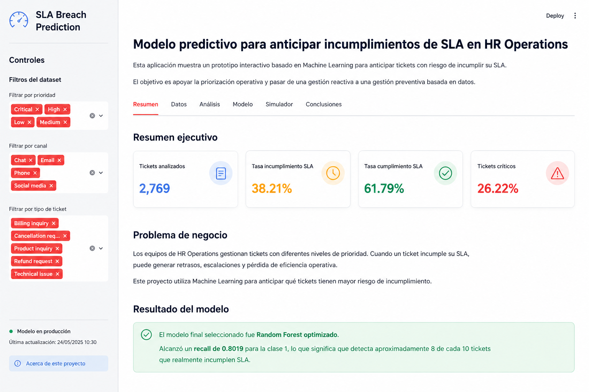
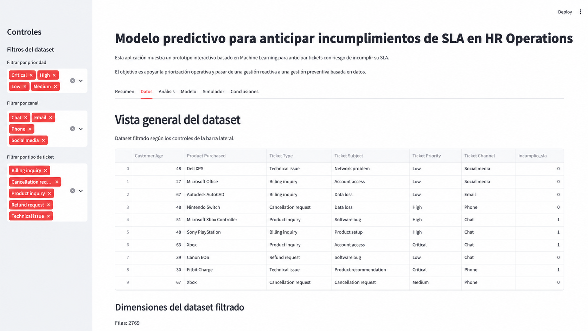
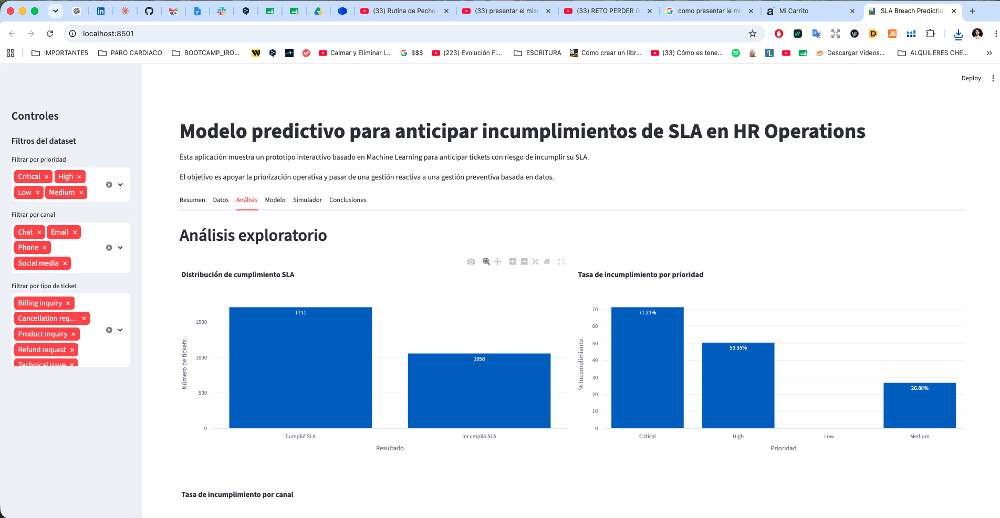
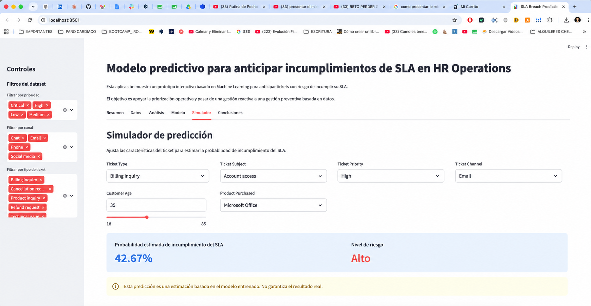
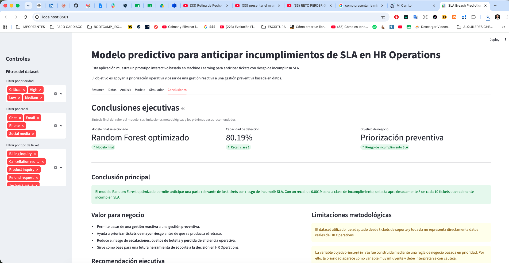

# HR SLA Breach Prediction


[](https://hr-sla-breach-prediction.streamlit.app/)

> Part of the **HR Operations Intelligence Suite** — a portfolio of end-to-end analytics solutions designed to optimize, predict and support decision-making across HR Operations.

## Predictive Risk Intelligence for HR Operations



This project develops an end-to-end Machine Learning solution that predicts Service Level Agreement (SLA) breaches before they occur, enabling HR Operations teams to proactively identify high-risk operational cases.

Rather than reacting to delayed cases, the solution helps operational teams identify high-risk tickets early, prioritize interventions and support preventive decision-making through predictive analytics.

The project follows an end-to-end analytics workflow, including data preparation, business rule engineering, model comparison, hyperparameter optimization, model interpretation and deployment through an interactive Streamlit application.

---

# Executive Summary

| Category | Detail |
|----------|---------|
| Portfolio Suite | HR Operations Intelligence Suite |
| Module | Predictive Risk Intelligence |
| Project Type | End-to-End Machine Learning |
| Business Domain | HR Operations |
| Business Problem | Predict SLA breaches before they occur |
| Target Variable | `incumplio_sla` |
| Machine Learning Task | Binary Classification |
| Final Model | Optimized Random Forest |
| Model Selection Strategy | Recall-oriented optimization |
| Recall (Class 1) | 80.19% |
| Deployment | Streamlit |
| Business Value | Preventive Operations · Risk Prioritization · Decision Support |


---


# Business Problem

## Business Context

HR Operations teams process thousands of operational requests every day, including onboarding, payroll, employee data updates, internal access requests and benefits administration. Most of these processes are governed by Service Level Agreements (SLAs) that define the maximum acceptable resolution time for each ticket.

Maintaining SLA compliance is essential to ensure operational efficiency, service quality and employee satisfaction.

---

## Operational Challenge

In high-volume environments, supervisors usually identify potential SLA breaches only after operational delays have already occurred.

This reactive approach often leads to:

- SLA violations and missed service commitments.
- Escalations from employees and internal stakeholders.
- Increased operational pressure on HR teams.
- Reduced employee experience.
- Lower confidence in HR service delivery.
- Additional effort to recover delayed cases.

The main challenge is not detecting delayed tickets, but identifying **which active cases are most likely to become delayed before the SLA is breached.**

---

## Business Question

> **Can we proactively identify high-risk operational tickets before they violate their SLA?**

Answering this question would allow HR Operations teams to prioritize resources based on risk instead of reacting after service failures occur.

---

## Why Machine Learning?

Historical operational data contains patterns that traditional rule-based monitoring cannot easily capture.

Machine Learning makes it possible to:

- learn historical risk patterns;
- estimate the probability of SLA breaches for new tickets;
- prioritize interventions using predictive evidence;
- support operational decisions with consistent and scalable risk assessment.

Rather than replacing human judgment, the model acts as an early warning system that helps teams focus attention where it is needed most.

---

## Expected Business Impact

If deployed in a real HR Operations environment, the solution could contribute to:

- Earlier identification of high-risk tickets.
- Better prioritization of operational workload.
- Reduction of preventable SLA breaches.
- More efficient allocation of HR resources.
- Improved employee service quality.
- Data-driven operational decision-making.

---

# Project Objective

The objective of this project is to develop an explainable Machine Learning solution capable of identifying HR operational tickets with the highest probability of violating their Service Level Agreement (SLA).

Rather than predicting delays as an isolated technical exercise, the model is designed to support operational prioritization by enabling earlier interventions on high-risk cases.

The final objective is to transform historical operational data into actionable decision support for HR Operations teams.

---

# Analytical Approach

The project follows an end-to-end workflow designed to connect operational business needs with predictive modeling and decision support.

| Stage | Description |
|------|-------------|
| Business Understanding | Defined the operational problem: anticipating SLA breaches before they occur. |
| Data Understanding | Explored the ticket dataset and identified the fields required to model SLA risk. |
| Data Preparation | Filtered closed tickets, cleaned temporal inconsistencies and prepared the modeling dataset. |
| Target Engineering | Created the target variable `incumplio_sla` using business rules based on expected SLA thresholds. |
| Feature Engineering | Prepared categorical and numerical variables for model training. |
| Model Benchmarking | Compared multiple classification models before selecting the final approach. |
| Hyperparameter Optimization | Optimized the Random Forest model using recall-oriented tuning. |
| Model Interpretation | Reviewed feature importance and methodological limitations. |
| Interactive Deployment | Built a Streamlit application for exploration, prediction and operational recommendations. |

---

# Machine Learning Strategy

Several classification algorithms were evaluated before selecting the final model.

The final solution was optimized for operational risk detection rather than overall accuracy.

Key design decisions included:

- Random Forest selected after model benchmarking.
- Recall used as the primary optimization metric.
- Hyperparameter tuning performed to maximize high-risk case detection.
- Class imbalance handled through `class_weight = balanced`.
- Model evaluation focused on operational usefulness rather than only statistical performance.

This strategy prioritizes identifying as many potential SLA breaches as possible, accepting a limited increase in false positives to reduce missed high-risk operational cases.

---
# Business Recommendations

The predictive model is intended to support operational decision-making rather than replace human judgment.

Based on the predicted risk level, HR Operations teams can apply actions such as:

| Prediction | Recommended Action | Expected Business Value |
|------------|--------------------|-------------------------|
| Low Risk | Continue with the standard workflow. | Efficient resource allocation. |
| Medium Risk | Monitor the ticket more closely and review workload distribution. | Early prevention of delays. |
| High Risk | Escalate the case, prioritize processing and notify supervisors. | Reduced SLA breaches and improved service quality. |

By translating model predictions into operational actions, the solution enables proactive workload management and supports consistent decision-making across HR Operations teams.

---
# Model Performance

The final model was an optimized Random Forest classifier selected for its ability to detect high-risk SLA breach cases.

Because the business objective is to identify as many potential SLA breaches as possible, the model was optimized using **Recall for Class 1** rather than overall accuracy.

| Metric | Value |
|--------|------:|
| Accuracy | 72.92% |
| Precision (Class 1 - SLA Breach) | 61.15% |
| Recall (Class 1 - SLA Breach) | 80.19% |
| F1-score (Class 1 - SLA Breach) | 69.39% |

## Confusion Matrix

| Actual / Predicted | Predicted: SLA Met | Predicted: SLA Breach |
|--------------------|-------------------:|----------------------:|
| Actual: SLA Met | 234 | 108 |
| Actual: SLA Breach | 42 | 170 |

## Interpretation

The optimized model correctly identified **170 SLA breach cases** and missed **42 breach cases**.

From a business perspective, the most relevant result is the **80.19% recall for SLA breaches**, meaning the model detects approximately 8 out of 10 tickets that actually breach their SLA.

This makes the model useful as an early-warning system for operational prioritization, where missing high-risk cases is more costly than flagging some cases for additional review.

---
# Model Optimization Results

The baseline Random Forest model was improved through hyperparameter tuning and recall-oriented optimization.

| Model Version | Recall (Class 1 - SLA Breach) |
|--------------|------------------------------:|
| Baseline Random Forest | 58.02% |
| Optimized Random Forest | 80.19% |

The optimization process increased the model's ability to detect SLA breach cases by more than 22 percentage points.

This improvement is especially relevant from a business perspective because missed SLA breach cases represent the highest operational risk.

---
# Technology Stack

| Category | Technologies |
|----------|--------------|
| Programming Language | Python 3.11 |
| Data Analysis | Pandas, NumPy |
| Visualization | Matplotlib, Seaborn |
| Machine Learning | Scikit-learn |
| Model | Random Forest Classifier |
| Hyperparameter Tuning | GridSearchCV |
| Class Imbalance | class_weight="balanced" |
| Deployment | Streamlit |
| Development Environment | Jupyter Notebook |
| Version Control | Git & GitHub |

The project combines business analytics, feature engineering, supervised Machine Learning and interactive deployment to create an end-to-end predictive analytics solution.

---

# Feature Engineering

One of the most important phases of the project was transforming operational ticket information into predictive variables capable of identifying SLA breach risk.

The original dataset contained operational attributes such as:

- Ticket priority
- Support channel
- Case category
- Resolution times
- Opening and closing timestamps

These variables were cleaned, encoded and transformed into machine learning features.

## Main Feature Engineering Tasks

- Removed irrelevant identifiers.
- Treated missing values.
- Encoded categorical variables.
- Converted temporal fields to datetime format to calculate resolution duration and engineer the SLA breach target.
- Standardized data structure for model training.
- Created the target variable (`incumplio_sla`) using business rules.

The resulting dataset provided meaningful operational signals that allowed the model to distinguish between low-risk and high-risk tickets.

---

# Business Insights

The analysis identified several operational patterns associated with SLA breach risk.

## Key Findings

- High-priority tickets were significantly more likely to breach SLA.
- Certain operational channels accumulated a larger proportion of delayed cases.
- Ticket priority was the dominant predictive signal, while ticket type and channel contributed smaller secondary effects.
- Historical ticket attributes provided sufficient predictive signal to identify patterns associated with SLA breach risk.

## Operational Value

These findings allow HR Operations teams to move from reactive incident management to proactive workload prioritization.

Instead of reviewing every active ticket manually, supervisors can focus attention on cases with the highest predicted operational risk.

This approach improves resource allocation while reducing preventable SLA violations.

---

# Project Limitations

Although the model provides useful predictive support, several limitations should be considered:

- The dataset was adapted from support ticket data and does not represent a real HR Operations production system.
- The target variable `incumplio_sla` was created using business rules, not from an original SLA breach label.
- The model should be interpreted as a decision-support tool, not as an automatic decision system.
- Performance should be monitored if deployed in a real operational environment.
- Additional production variables, such as workload, queue age, reassignment history and staffing capacity, could improve predictive performance and operational relevance.

---
# Future Improvements

Potential future improvements include:

- Integrating the model with live HR ticketing systems.
- Adding SHAP values to improve model explainability.
- Building a real-time risk scoring pipeline.
- Monitoring model drift over time.
- Retraining the model periodically with new operational data.
- Connecting the app to Power BI or Tableau dashboards.
- Adding user authentication and role-based access.

---

# Interactive Application
🔗 **Live Demo:** https://hr-sla-breach-prediction.streamlit.app/

The project includes an interactive Streamlit application that allows users to explore the predictive model from a business perspective.

## Main Features

- Explore the processed dataset.
- Review operational KPIs.
- Predict SLA breach risk for new tickets.
- Analyze model performance.
- Support operational decision-making.
- Demonstrate the end-to-end Machine Learning workflow.


---

# Streamlit Application Showcase

The Streamlit application was designed as an interactive business-facing layer for exploring operational patterns, understanding model behavior and simulating SLA breach risk in a practical way.

## Home

<p align="center">
  
</p>

The home section presents the executive summary of the solution, including filtered KPIs, business context and the main predictive outcome.

---

## Dataset

<p align="center">
  
</p>

This section allows users to inspect the filtered dataset and understand the structure of the operational information used in the predictive workflow.

---

## Exploratory Analysis

<p align="center">
  
</p>

The exploratory analysis section highlights key operational patterns related to SLA compliance, helping users identify how breach behavior varies across priority levels and support channels.

---

## Risk Simulator

<p align="center">
  
</p>

The simulator allows users to input ticket characteristics and obtain a predictive assessment of SLA breach risk, supporting operational prioritization and preventive action.

---

## Conclusions

<p align="center">
  
</p>

The conclusions section summarizes the operational value of the project, reinforcing how predictive analytics can support proactive decision-making in HR Operations.

---

# Installation

```bash
git clone https://github.com/gabriel-bohorquez/hr_sla_breach_prediction.git
cd hr_sla_breach_prediction

python3 -m venv .venv
# macOS / Linux
source .venv/bin/activate

# Windows
.venv\Scripts\activate

python3 -m pip install --upgrade pip
python3 -m pip install -r requirements.txt

streamlit run app/app.py
```

---

# Credits

Developed by **Gabriel Bohorquez** as an end-to-end Data Analytics and Machine Learning project focused on HR Operations, predictive analytics, and proactive SLA risk prioritization.

The project combines business analysis, exploratory data analysis, machine learning, model interpretation, interactive analytics, and Streamlit deployment to demonstrate a complete end-to-end workflow.

---

# Contact

- 💼 LinkedIn: [linkedin.com/in/eb20](https://www.linkedin.com/in/eb20)
- ✉️ Email: [gbohorquez2020@gmail.com](mailto:gbohorquez2020@gmail.com)
- 🚀 Live Demo: [HR SLA Breach Prediction](https://hr-sla-breach-prediction.streamlit.app/)
- 💻 GitHub: [github.com/gabriel-bohorquez](https://github.com/gabriel-bohorquez)

---

# About this portfolio

This repository is part of my Data Analytics and Machine Learning portfolio, showcasing end-to-end projects that combine business understanding, analytics, predictive modeling, reproducibility, and decision-support solutions.

More projects are available on my GitHub profile.

⭐ If you found this repository useful, consider giving it a star.
